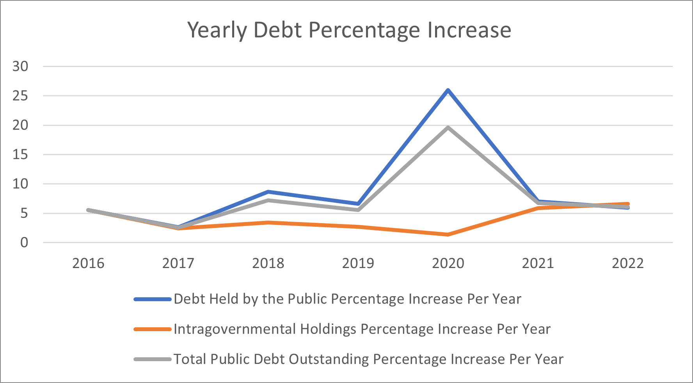
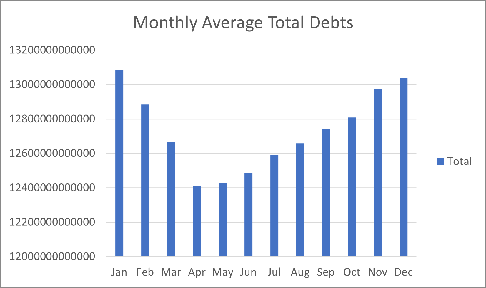
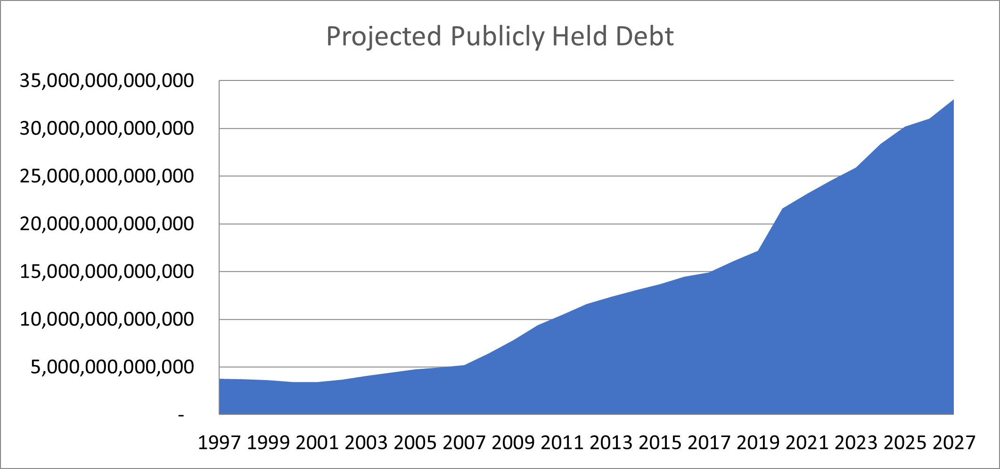

# US Debt Tracker (Excel 2021)

## Introduction
This Excel project analyzes U.S. public debt through year-over-year changes, monthly historical patterns via a PivotTable, and an ETS-based projection. It’s built as a clean, portfolio-ready deliverable—no macros.

## Questions to Analyze
- What was the **Yearly Debt Percentage Increase** for each year compared to the previous year?
- Which **months historically** have seen the **highest/lowest increases** in Total debt?
- What is the **projected growth of the publicly held debt** in the next few years?

## Excel Skills Used
- **PivotTable** (Monthly Historicals): Rows = Month, Values = **Average of Total Public Debt Outstanding (TPDO)**
- **Time series**: `FORECAST.ETS`, `EOMONTH`, `EDATE`
- **Modern lookups / dynamic arrays**: `XLOOKUP`, `SEQUENCE`, `UNIQUE`, `SORT`, `FILTER` (where applicable)
- **Charts**: line/column; number formatting for billions/trillions; freeze panes; clean layout

## Overview of the Dataset
- **Rows (series):** Debt Held by the Public · Intragovernmental Holdings · Total Public Debt Outstanding  
- **Timeline (columns):** **Apr 1, 1993 → Feb 15, 2023** (7,495 daily dates)

## Analysis (Insights)
- **Yearly:** year-end totals and YoY% highlight multi-year trend and acceleration/slowdown.
- **Monthly Historicals (PivotTable):** average TPDO by calendar month surfaces seasonal highs/lows.
- **Projection:** `FORECAST.ETS` provides an ETS-based short-term outlook; treat as illustrative (sensitive to gaps/outliers).

## Visual Highlights
  
*Figure 1 — Year-end TPDO trend / YoY context*

  
*Figure 2 — Average TPDO by calendar month (PivotTable)*

  
*Figure 3 — `FORECAST.ETS` projection (illustrative)*

## Conclusion
As a data enthusiast and job seeker, I built this Excel-based analysis to uncover clear, reproducible insights about U.S. public debt—combining PivotTable monthly summaries, year-end comparisons, and an ETS forecast to communicate both history and an indicative outlook.

## License
MIT
